# SpRAy on MNIST

- generated using `spray_mnist.py mnist.h5`

| Label | Eigenval                            | TSNE                        | Examples                            |
| ----- | ----------------------------------- | --------------------------- | ----------------------------------- |
| 0     | 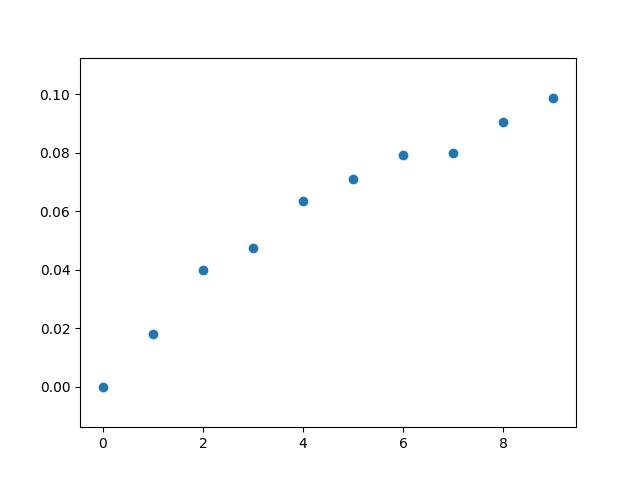 | 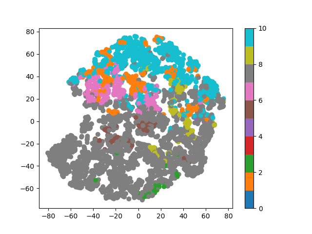 | 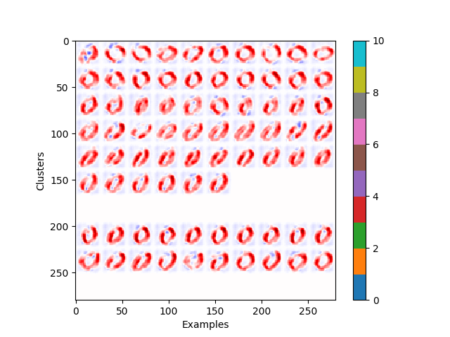 |
| 1     | 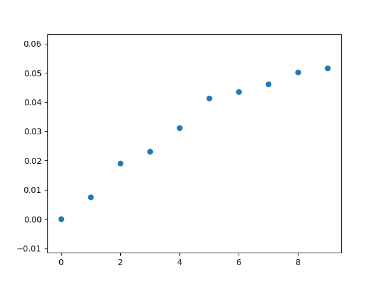 | 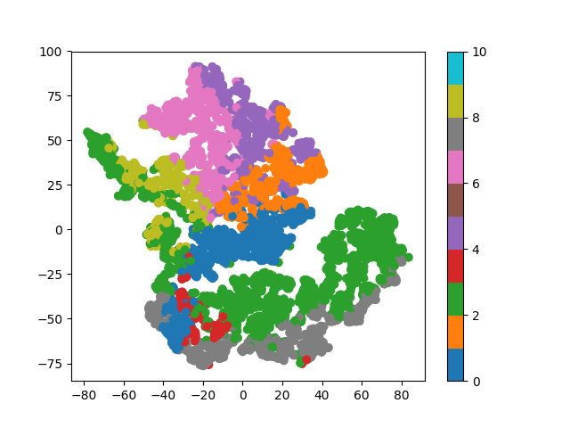 | 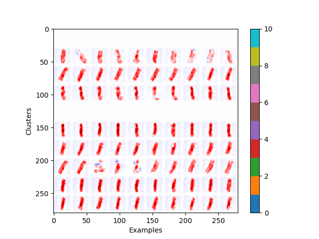 |
| 2     | 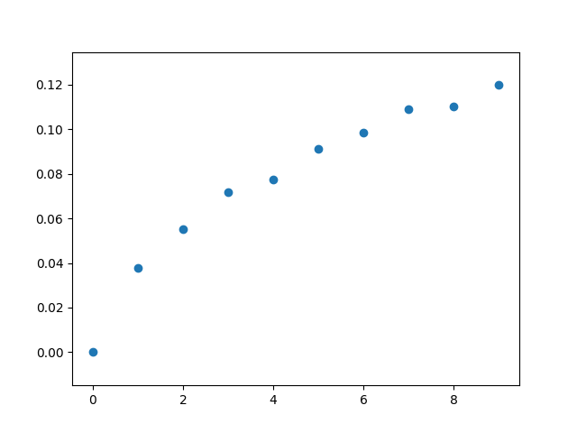 | 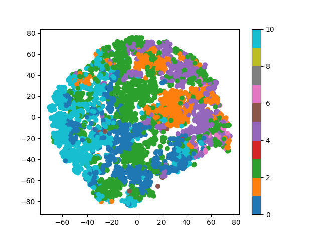 | 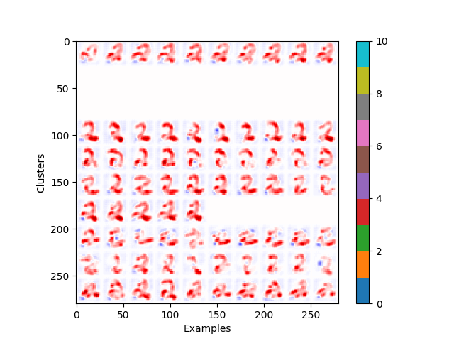 |
| 3     | 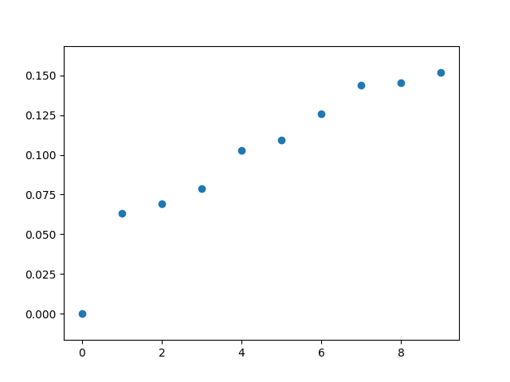 | 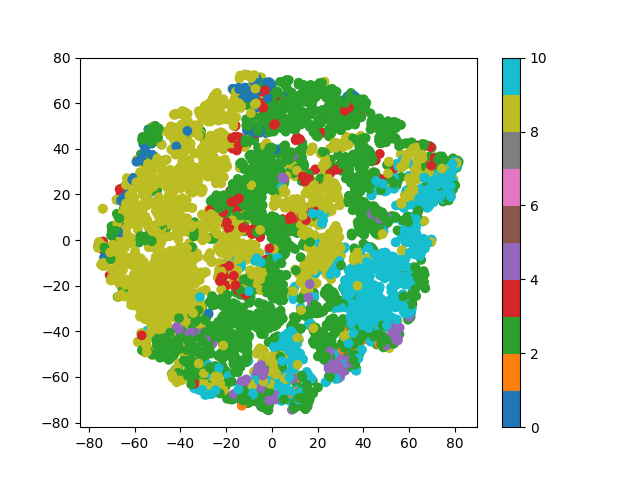 | 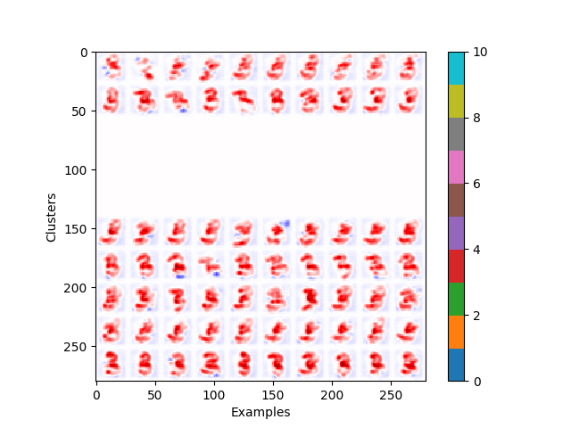 |
| 4     | 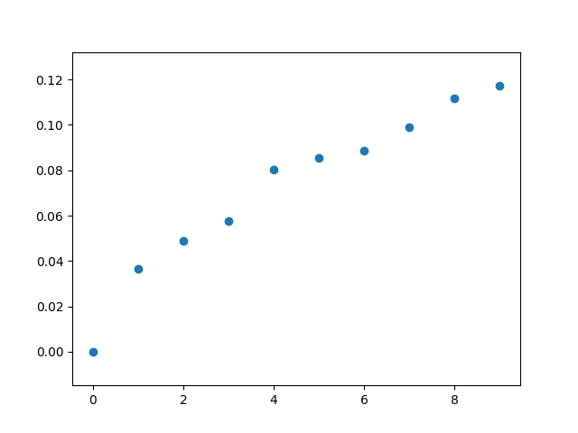 |  | 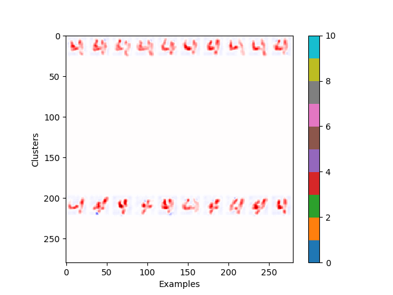 |
| 5     | 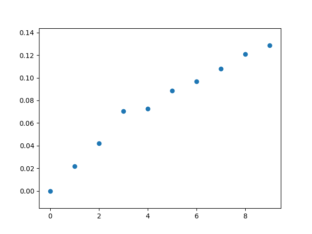 | 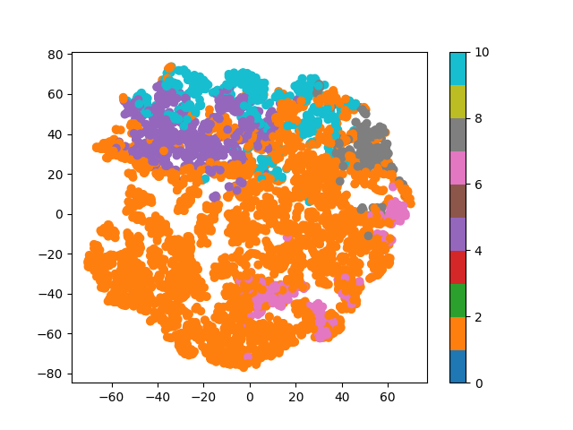 | 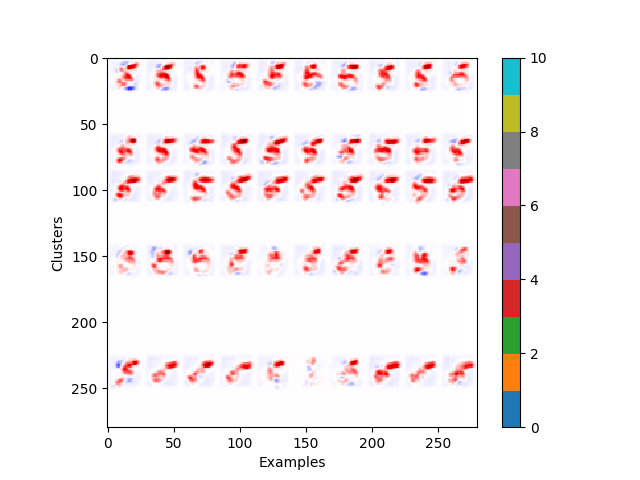 |
| 6     | 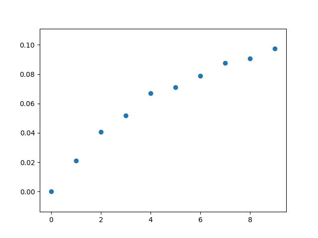 | 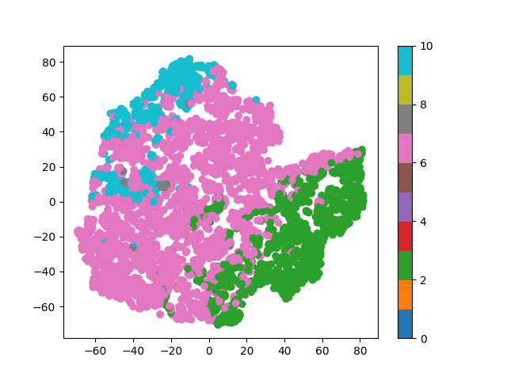 | 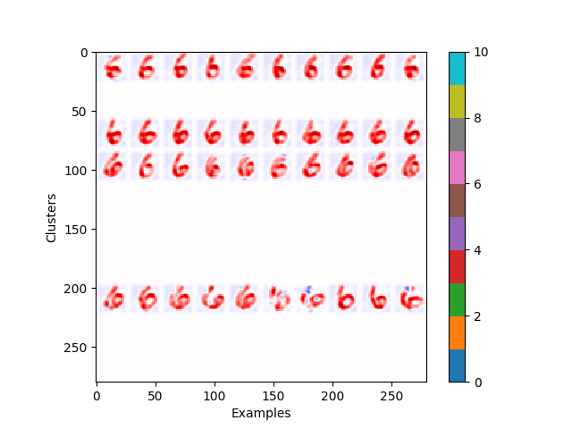 |
| 7     | 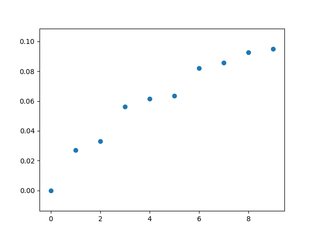 | 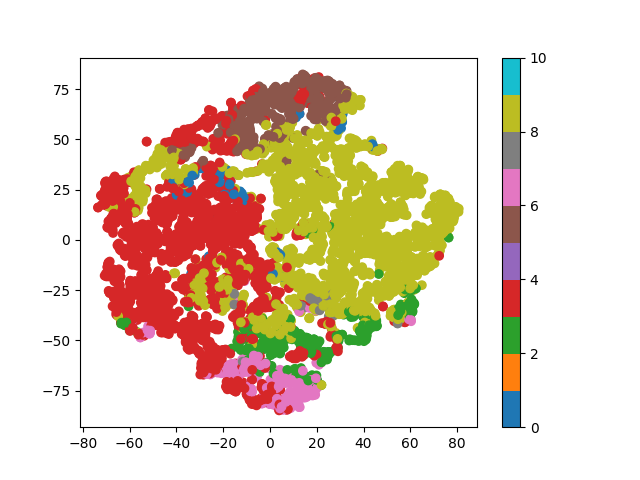 | 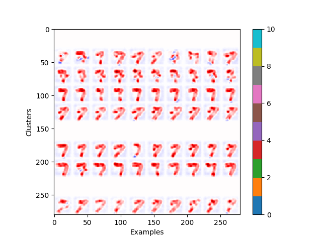 |
| 8     | 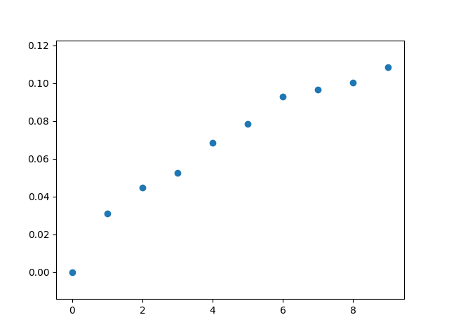 | 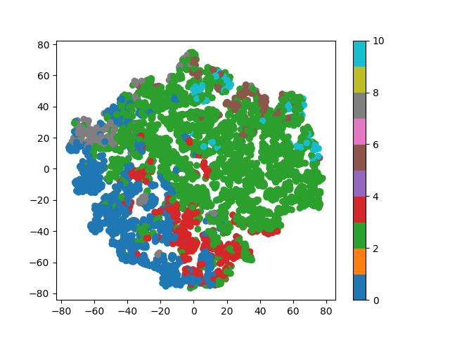 | 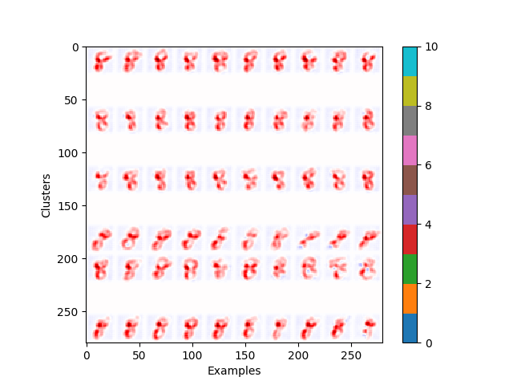 |
| 9     | 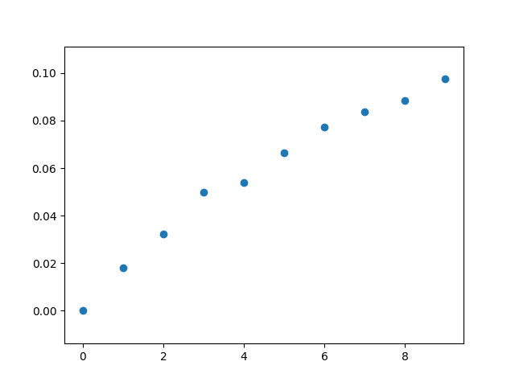 | 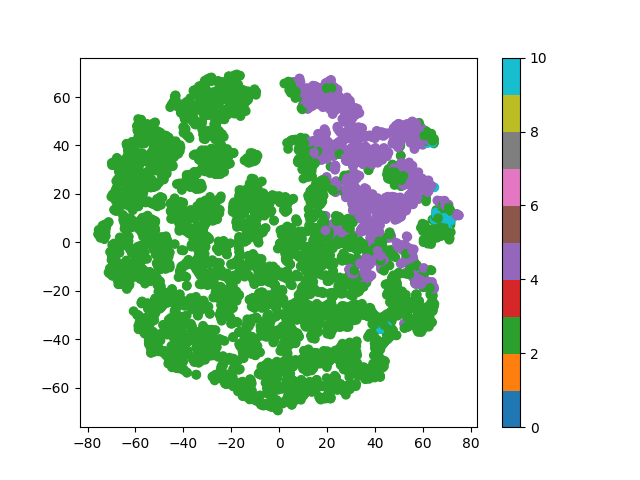 | 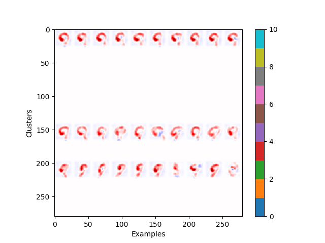 |

