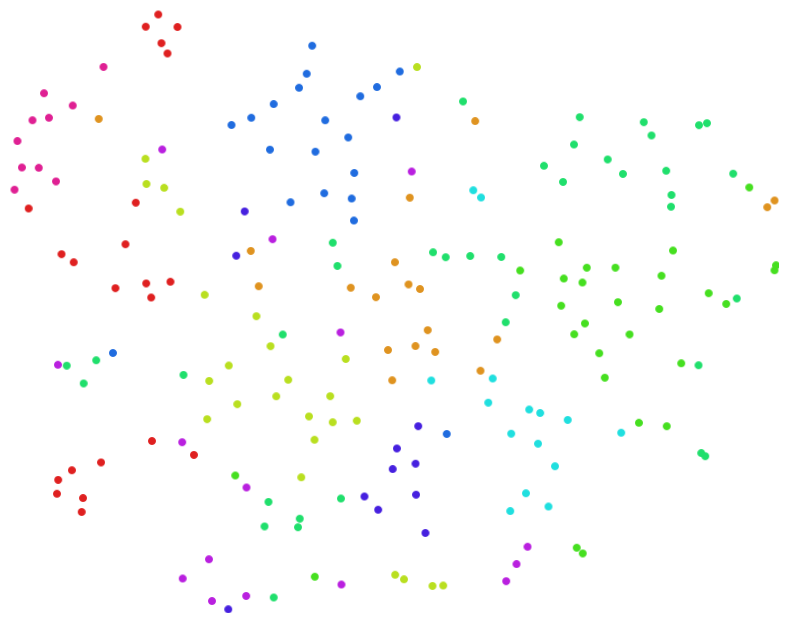
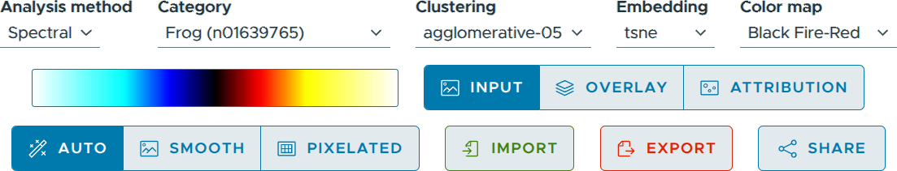

===========
Basic Usage
===========

If you already have a project file that you would like to open, ViRelAy can be started on the command line using the following command. If you do not have a project file yet, you can read the :doc:`example-project` article, which guides you through the creation of a randomly generated project that you can use to familiarize yourself with the ViRelAy user interface. Creating a real-world project is much more involved, but if you would like to skip ahead, please refer to the :doc:`../user-guide/how-to-create-a-project` article, which describes the project creation process in-depth.

.. code-block:: console

    $ virelay '<project-file>' ['<project-file>' ...]

This command will start the server at http://localhost:8080 and automatically open your default browser. Optionally, you can specify an alternative host and port using the ``--host`` and ``--port`` command line arguments.

Please note that starting ViRelAy using the provided command line interface will start a rather slow development server. For improved load times or when running ViRelAy on a remote server, we recommend using the WSGI HTTP server Gunicorn. For more information, please refer to :doc:`../user-guide/using-virelay-with-gunicorn`.

After launching ViRelAy, you will be greeted with a user interface like in the following screenshot. The exact setup will depend on the project(s) that you have loaded, but in this instance the randomly generated test project is shown:

.. figure:: ../../images/getting-started/basic-usage/virelay-ui.png
    :alt: ViRelAy UI
    :align: center

    Figure 1: The user interface of ViRelAy.

At the very top of the ViRelAy UI, all loaded projects are displayed in tabs. Clicking a project tab will switch to the selected project. Figure 2 shows what the project selection looks like, when multiple projects are loaded.

.. figure:: ../../images/getting-started/basic-usage/project-selection.png
    :alt: Project Selection in the ViRelAy UI
    :align: center

    Figure 2: The project selection in the ViRelAy UI, where all loaded projects are displayed as tabs.

At the very bottom of the ViRelAy UI, some basic information about the currently selected project is displayed: the name of the project, the name of the dataset that the classifier, on which the project is based, was trained on, and the name of the classifier model itself. Figure 3 shows the project info pane for the test project.

    Figure 3: The project info pane in the ViRelAy UI, which shows some basic information about the currently selected project.

In the center of the ViRelAy UI, the embedding viewer is situated. The embedding viewer displays the samples of the currently selected sample category. The samples are displayed as a point cloud using the currently selected embedding method. Each analysis in a project can contain multiple embedding methods. The colors of the sample points correspond to the cluster they belong to, according to the currently selected clustering.

    Figure 4: The embedding viewer in the ViRelAy UI, where the samples of the currently selected category are visualized using the selected embedding method.

The embedding viewer supports panning and zooming. To start panning click and hold the right mouse button and start moving the mouse pointer. Scrolling the mouse wheel will zoom into the region the mouse pointer is currently pointing at. Alternatively, click and hold the middle mouse button to start zooming and move the mouse pointer up and down to zoom in and out. When hovering the mouse pointer over a sample point, the dataset sample, which is the input of the classifier, is previewed at the top left of the embedding viewer. Samples can be selected by clicking and holding the left mouse button and moving the mouse pointer to draw a selection rectangle. Sample points outside of the selection will be in a muted color, while the selected sample points will have an increased saturation.

When sample points have been selected, the sample viewer at the bottom of the ViRelAy UI shows the samples corresponding to the selected sample points. Depending on the currently selected visualization mode, the sample viewer will display the dataset sample, which is the input to the classifier, the attribution of the classification, or an attribution superimposed onto the dataset sample. Attributions will be displayed as heatmaps using the currently selected color map. Both the visualization mode and the color map can be selected in the toolbox, which is situated right above the embedding viewer.

On the far right of the ViRelAy UI, the eigenvalues of the embedding as well as the clusters of the currently selected clustering method can be seen. The eigenvalue plot shows the eigenvalues of the eigendecomposition of the currently selected embedding method in ascending order. Below the eigenvalue plot, a list of all clusters of the current clustering are displayed. These can be used to quickly select all sample points belonging to a cluster, by clicking the corresponding clustering.

Finally, at the top of the ViRelAy UI, below the project selection, the toolbox is situated. The toolbox allows the user to navigate the data of the current project. The toolbox can be seen in Figure 5.

    Figure 5: On the top of the ViRelAy UI the toolbox is displayed, where the user can select the analysis method, sample category, clustering method, embedding method, and the color map among other things. The image of the toolbar was broken up and stacked vertically to improve legibility.

For a detailed explanation of all features of ViRelAy, please refer to the :doc:`../user-guide/features` article.
