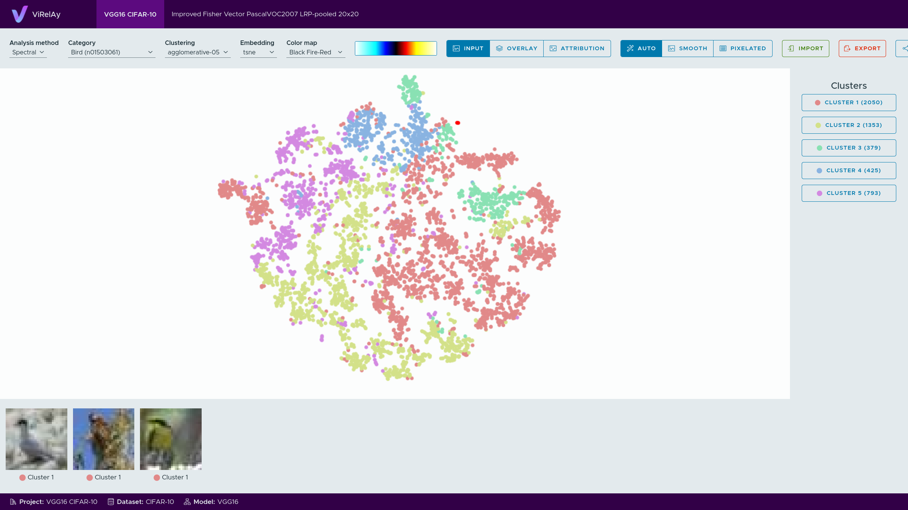
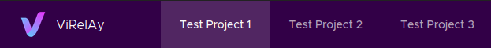
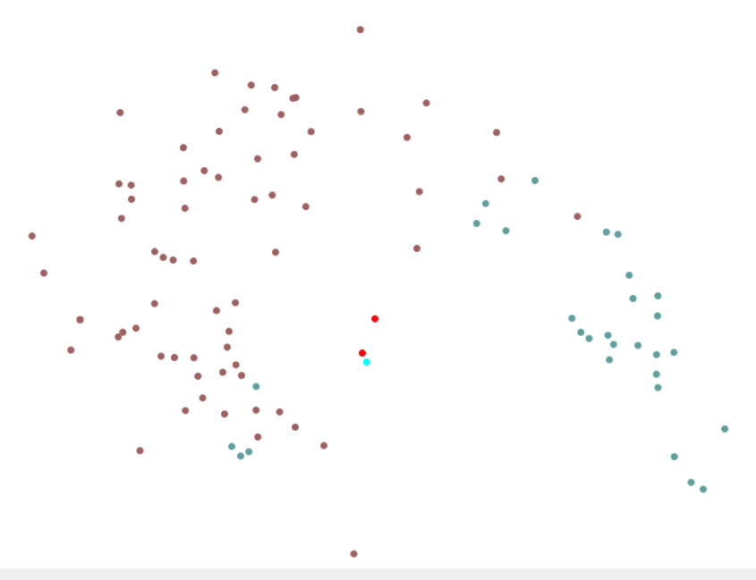
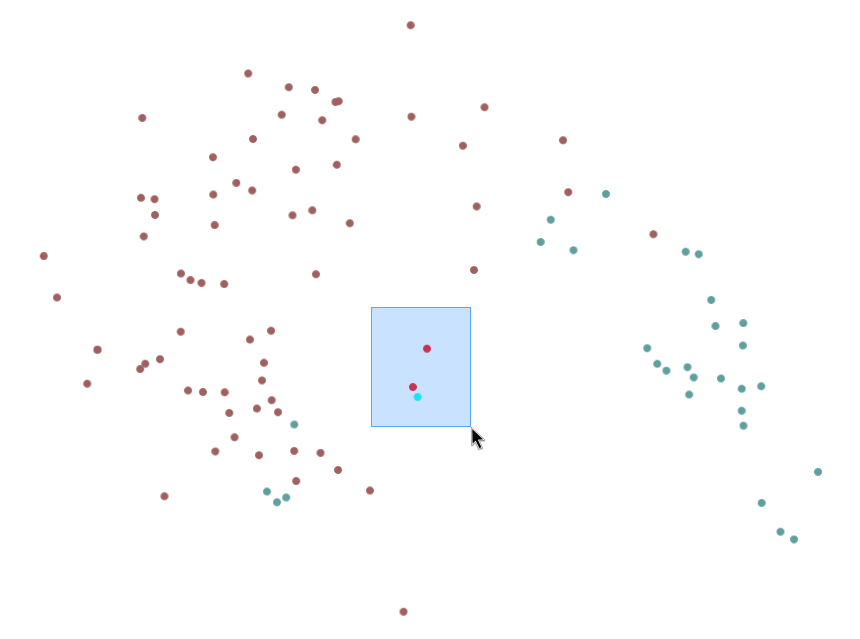
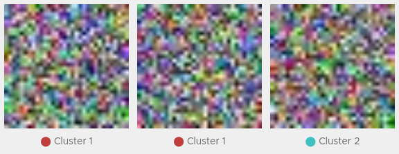
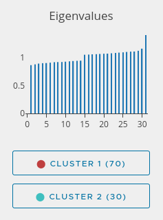
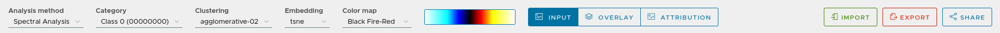

===========
Basic Usage
===========

If you already have a project file that you want to open, ViRelAy can be started on the command line using the following command. If you do not have a project file yet, you can read the :doc:`example-project` article, which guides you through the creation of a randomly generated project that you can use to familiarize yourself with the ViRelAy user interface.

.. code-block:: console

    $ python -m virelay <project-file> [<project-file>, ...]

This will start the server at http://localhost:8080 and automatically open your default browser. Optionally, you can specify an alternative host and port using the ``--host`` and ``--port`` command line arguments.

Please note that while starting ViRelAy using the provided command line interface will start a rather slow development server. For improved load times or when running ViRelAy on a remote server, we recommend using the WSGI HTTP server Gunicorn. For more information, please refer to :doc:`../user-guide/using-virelay-with-gunicorn`.

After launching ViRelAy, you will be greeted with a user interface like in the following screenshot. The exact setup will depend on the project(s) that you have loaded, but in this instance the randomly generated test project is shown:

    Figure 1: The user interface of ViRelAy.

At the very top of the ViRelAy UI, all loaded projects are displayed. Clicking the project links will switch between the loaded projects. Figure 2 shows what the project selection looks like, when multiple projects are loaded.

    Figure 2: The project selection in the ViRelAy UI.

At the very bottom of the ViRelAy UI, some basic information about the currently selected project is displayed: the name of the project, the name  dataset that the classifier, on which the project is based, was trained on, and the name of the classifier model itself. Figure 3 shows the project info pane for the test project.

    Figure 3: The project info pane in the ViRelAy UI, which shows some basic information about the currently selected project.

In the center of the ViRelAy UI, the embedding viewer is situated. The embedding viewer displays the samples of the currently selected sample category. When creating a project, the samples of the dataset can be categorized however you like, but it usually makes the most sense to categorize them by their class. The samples are displayed as a point cloud using the currently selected embedding method. Each analysis in a project can contain multiple embedding methods. If the embedding has more than two dimensions, then the first two dimensions are displayed by default. The colors of the sample points correspond to the cluster they belong to, according to the currently selected clustering. A spectral embedding for the first class of the test project dataset using agglomerative clustering with two clusters can be seen in Figure 4.

    Figure 4: The embedding viewer in the ViRelAy UI, where the samples of the currently selected category are visualized using the selected embedding method.

The embedding viewer supports panning and zooming. To start panning click and hold the right mouse button and start moving the mouse pointer. Scrolling the mouse wheel will zoom into the region the mouse pointer is currently pointing at. Alternatively, click and hold the middle mouse button to start zooming and move the mouse pointer up and down to zoom in and out. When hovering the mouse pointer over a sample point, the dataset sample, which is the input of the classifier, is previewed at the top left of the embedding viewer. An example of this can be seen in Figure 5.

.. figure:: ../../images/getting-started/basic-usage/virelay-ui-sample-preview.png
    :alt: Sample Preview in the Embedding Viewer of the ViRelAy UI
    :align: center

    Figure 5: When hovering the mouse pointer over a sample in the embedding viewer, a preview of the dataset sample is displayed in the upper left corner of the embedding viewer.

Finally, samples can be selected by clicking and holding the left mouse button and moving the mouse pointer to draw a selection rectangle. Sample points outside of the selection will be in a muted color, while the selected sample points will have an increased saturation. The selection process can be seen in Figure 6.

    Figure 6: Samples can be selected in the embedding viewer by left-clicking and dragging the mouse pointer.

When sample points have been selected, the sample viewer at the bottom of the ViRelAy UI shows the samples corresponding to the selected sample points (to increase performance, only the first 20 samples will be displayed). Depending on the currently selected visualization mode, the sample viewer will display the dataset sample, which is the input to the classifier, the attribution of the classification, or an attribution superimposed on the dataset sample. Attributions will be displayed as heatmaps using the currently selected color map. Both the visualization mode and the color map can be selected in the toolbox. An example of samples being displayed in the sample viewer for the randomly generated test project can be seen in Figure 7.

    Figure 7: Selected samples are displayed in the sample viewer at the bottom of the ViRelAy UI. The sample viewer can either show the dataset samples, the heatmap of the attribution, or the heatmap superimposed onto the dataset sample.

On the far right of the ViRelAy UI, the eigenvalues of the embedding (if the currently selected embedding method uses eigenvalue decomposition) as well as the clusters of the currently selected clustering method can be seen. The eigenvalue plot shows the eigenvalues of the eigen decomposition of the currently selected embedding method in ascending order. Large changes between successive eigenvalues are called an eigengap, which can be used to find the optimal number of clusters. Hovering over the eigenvalues will display the number of clusters the eigenvalue corresponds to.

Below the eigenvalue plot, a list of all clusters of the current clustering are displayed. These can be used to quickly select all sample points belonging to a cluster, by clicking the corresponding clustering. An example of an eigenvalue plot and a list of clusterings can be seen in Figure 8.

    Figure 8: On the right side of the ViRelAy UI the eigenvalues for the currently selected embedding method and quick selection buttons for the clusters of the currently selected clustering method are displayed.

Finally, at the top of the ViRelAy UI, below the project selection, the toolbox is situated. The toolbox allows the user to navigate the data of the current project. The toolbox for the randomly generated test project can be seen in Figure 9.

    Figure 9: On the top of the ViRelAy UI the toolbox is displayed, where the user can select the analysis method, sample category, clustering method, embedding method, and the color map among other things.

For a detailed explanation of the entire user interface and all features of ViRelAy, please refer to :doc:`../user-guide/user-interface`
