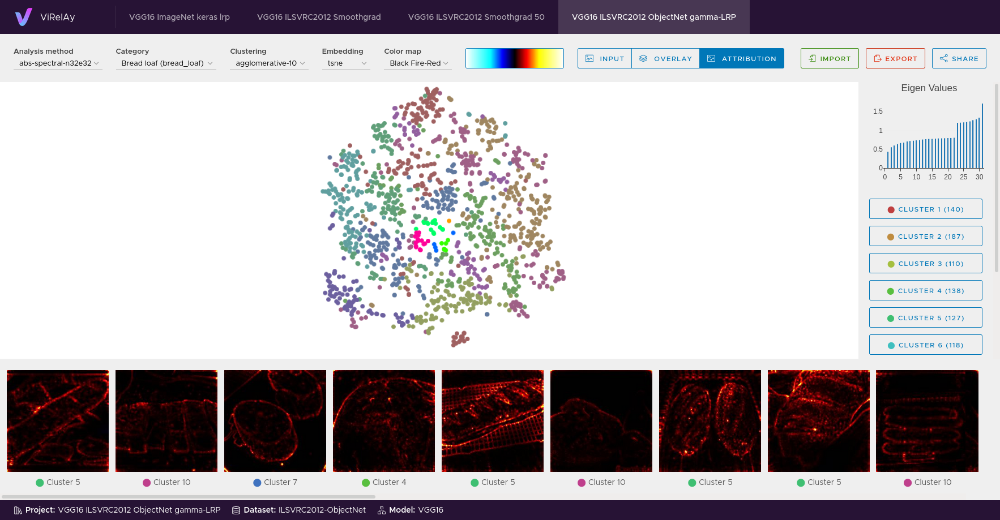

=====================
ViRelAy Documentation
=====================

Welcome to the documentation of ViRelAy, an XAI visualization tool for the analysis of the results of spectral relevance analysis (SpRAy) pipelines, as generated by `CoRelAy <https://github.com/virelay/corelay>`_. It runs a small web application to view, explore, and interact with the source data, its attributions, clusterings, and embeddings. ViRelAy is designed to simplify the analysis of classifiers and their underlying datasets. Findings can be imported, exported, and shared with others for easy collaboration. Currently, only image data is supported and attributions are expected to have the same shape as the corresponding input data.

    Figure 1: A screenshot of the ViRelAy user interface.

Contents
========

This documentation is organized into four main sections:

* **Getting Started** -- Basic instructions on how to install and use ViRelAy.
* **User Guide** -- In-depth information about all features of ViRelAy, including analysis techniques for classifiers and dataset, as well as usage examples.
* **Contributors Guide** -- An overview of the internal architecture of ViRelAy and guidelines for contributing to the project.
* **API Reference** -- Detailed descriptions of the modules, classes, methods, and functions included in the ViRelAy backend API. This part of the documentation is mainly aimed towards developers who want to contribute to the project.

.. toctree::
    :maxdepth: 2

    getting-started/index
    user-guide/index
    contributors-guide/index
    api-reference/index
    bibliography

Indices & Tables
================

* :ref:`genindex`
* :ref:`modindex`

Citing
======

We encourage you to cite our related paper :cite:p:`anders2021software` if ViRelAy has been useful for your research. To make it easier, we've included the relevant citation information below.

.. code-block:: bibtex

    @article{anders2021software,
      author  = {Anders, Christopher J. and
                 Neumann, David and
                 Samek, Wojciech and
                 Müller, Klaus-Robert and
                 Lapuschkin, Sebastian},
      title   = {Software for Dataset-wide XAI: From Local Explanations to Global Insights with {Zennit}, {CoRelAy}, and {ViRelAy}},
      journal = {CoRR},
      volume  = {abs/2106.13200},
      year    = {2021},
    }
