========
Features
========

In this article, all features of ViRelAy will be explained in detail. If you are new to ViRelAy, a shorter overview of the user interface can be found in :doc:`../getting-started/basic-usage`.

Projects
--------

When starting ViRelAy, a project file has to be specified. A project file contains all meta information about the project, such as the project name, the model name, the dataset name, etc., as well as the references to the dataset, label map, attribution, and analysis files. An example of a project file can be seen in the following listing. For more information about the project file format, please refer to the :doc:`../contributors-guide/project-file-format` article.

.. code-block:: yaml

    project:
    name: VGG16 ILSVRC2012-small SG
    model: VGG16
    label_map: datasets/ilsvrc2012/label-map-ilsvrc2012.json
    dataset:
        name: ILSVRC2012-small
        type: hdf5
        path: datasets/ilsvrc2012/ilsvrc2012-small.input.h5
        input_width: 224
        input_height: 224
        down_sampling_method: none
        up_sampling_method: none
    attributions:
        attribution_method: smoothgrad
        attribution_strategy: true_label
        sources:
        - ilsvrc2012-small-sg/attribution/ilsvrc2012-small.smoothgrad.h5
    analyses:
        - analysis_method: spectral_analysis
        sources:
            - ilsvrc2012-small-sg/analysis/ilsvrc2012-small.smoothgrad.h5

ViRelAy supports the loading of multiple project files at once. This can be helpful if multiple similar classifiers need to be compared. When running ViRelAy using its command line interface and the built-in HTTP server, multiple project files can be specified as arguments like so:

.. code-block:: console

    $ python -m virelay path/to/project-1.yaml path/to/project-2.yaml

When running ViRelAy using Gunicorn, multiple project files can either be passed as arguments to the ``create_app`` function or the project files can be specified as a colon separated list in the ``VIRELAY_PROJECTS`` environment variable. The ``projects`` argument of the ``create_app`` function takes precedent over the environment variable.

.. code-block:: console

    $ # Specifying multiple projects using the projects argument of the create_app function
    $ gunicorn \
        --workers 4 \
        --bind 127.0.0.1:8080 \
        "virelay.application:create_app(projects=['path/to/project-1.yaml', 'path/to/project-2.yaml'])"

    $ # Or using the VIRELAY_PROJECTS environment variable
    $ export VIRELAY_PROJECTS="path/to/project-1.yaml:path/to/project-2.yaml"
    $ gunicorn -w 4 -b 127.0.0.1:8080 "virelay.application:create_app()"

In the ViRelAy user interface, all loaded projects are displayed as tabs at the very top, next to the ViRelAy logo. Clicking a project tab will navigate the user to the respective project's page. The project selection can be seen in Figure 1.

    Figure 1: The project selection in the ViRelAy UI.

For the currently selected project, the project name, the dataset name, and the model name are displayed in the footer of the ViRelAy UI in the project info pane, which can be seen in Figure 2.

    Figure 2: The project info pane in the ViRelAy UI, which shows some basic information about the currently selected project.

Analyses
--------

Analyses are the result of quantitative analysis pipeline created with CoRelAy, e.g., using approaches such as Spectral Relevance Analysis (SpRAy) :cite:p:`lapuschkin2019cleverhans`, and consist of visual embeddings and clusterings of the attributions, which were generated (e.g., using Zennit) from the samples of the dataset using the project's classifier. Each ViRelAy project can consists of multiple analyses, which can be selected in the toolbox, which is situated at the top of the ViRelAy UI, right beneath the project selection, as can be seen in Figure 3.

.. figure:: ../../images/user-guide/features/analysis-selection.png
    :alt: Analysis Selection in the ViRelAy UI
    :align: center

    Figure 3: In the toolbox, the current analysis can be selected.

Clusterings & Embeddings
------------------------

As stated above, an analysis consists of visual embeddings and clusterings of the attributions of the project. Each analysis can contain multiple embeddings using different embedding methods. Furthermore, for each embedding, multiple clusterings with different clustering methods, as well as different parameters can be contained in an analysis. Embeddings are split up into categories. A category usually corresponds to a class of the dataset, but it can also be used to represent other things such as concepts or multiple classes in multi-label classification scenarios. The category, embedding method, and clustering method can be selected in the toolbox, which is situated at the top of the ViRelAy UI. The embedding viewer at the center of the ViRelAy UI always displays the sample points of the current category using the currently selected embedding method. The sample points are colored according to the currently selected clustering. The category selection, embedding selection, and clustering selection in the toolbox can be seen in Figure 4.

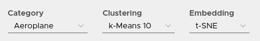

    Figure 4: In the toolbox, the current category, embedding, and clustering of the analysis can be selected.

If the selected embedding has more than 2 dimensions, then the first and second dimensions are displayed in the embedding viewer by default. Furthermore, the toolbox will display a selection for the dimensions that will be displayed on the X and Y axes of the embedding viewer. An example of the dimension selection for a spectral embedding with more than 2 dimensions can be seen in Figure 5.

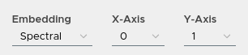

    Figure 5: When the currently selected embedding contains more than 2 dimensions, then the toolbox contains a selection for the dimensions that are displayed on the X and Y axis of the embedding viewer.

Navigating Embeddings
---------------------

In the center of the ViRelAy UI, the embedding viewer is situated. The embedding viewer displays the samples of the currently selected sample category. The samples are displayed as a point cloud using the currently selected embedding method. The colors of the sample points correspond to the cluster they belong to, according to the currently selected clustering. An example of an embedding being visualized in the embedding viewer can be seen in Figure 6.

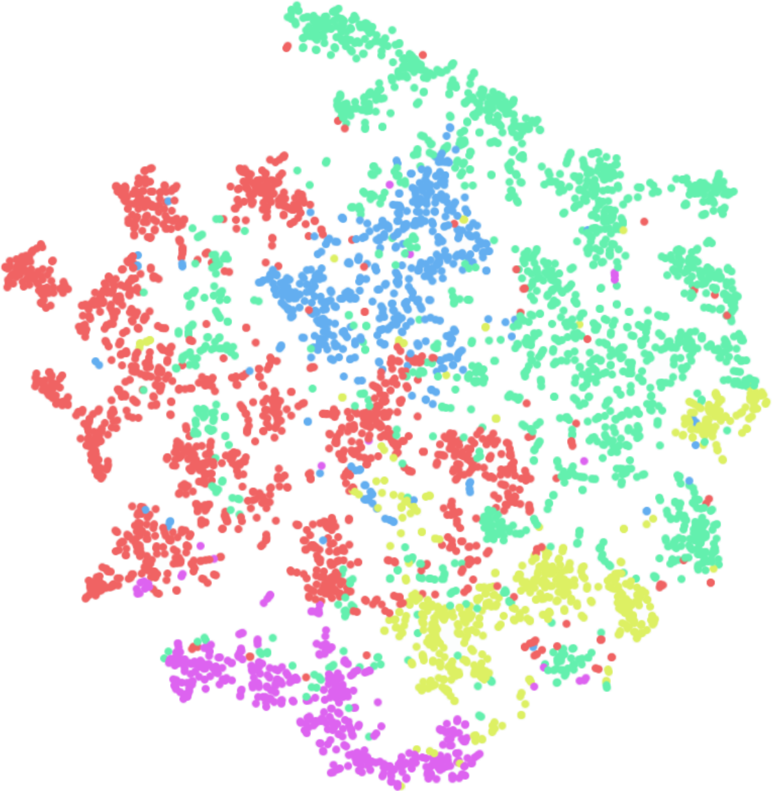

    Figure 6: The embedding viewer in the ViRelAy UI, where the samples of the currently selected category are visualized using the selected embedding method.

The embedding viewer supports panning and zooming. To start panning, click and hold the right mouse button and start moving the mouse pointer. Scrolling the mouse wheel will zoom into the region the mouse pointer is currently pointing at. Alternatively, click and hold the middle mouse button to start zooming and move the mouse pointer up and down to zoom in and out. When hovering the mouse pointer over a sample point, the dataset sample, which is the input of the classifier, is previewed at the top left of the embedding viewer. An example of this can be seen in Figure 7.

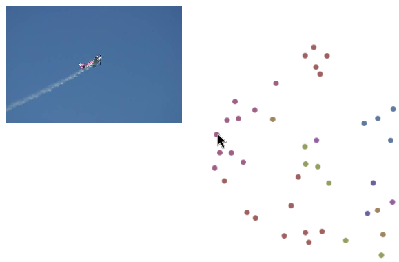

    Figure 7: When hovering the mouse pointer over a sample in the embedding viewer, a preview of the dataset sample is displayed in the upper left corner of the embedding viewer.

Finally, samples can be selected by clicking and holding the left mouse button and moving the mouse pointer to draw a selection rectangle. Sample points outside of the selection will be in a muted color, while the selected sample points will have an increased saturation. The selection process can be seen in Figure 8.

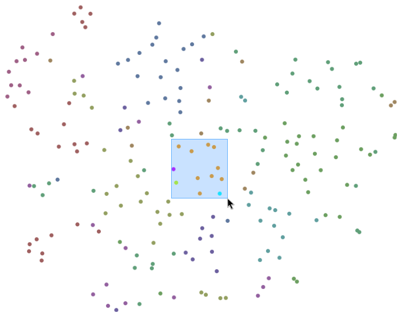

    Figure 8: Samples can be selected in the embedding viewer by left-clicking and dragging the mouse pointer.

On the far right of the ViRelAy UI, the eigenvalues of the embedding (if the currently selected embedding method uses eigenvalue decomposition) as well as the clusters of the currently selected clustering method can be seen. The eigenvalue plot shows the eigenvalues of the eigendecomposition of the currently selected embedding method in ascending order. Large changes between successive eigenvalues are called *eigengap*, which can be used to find the optimal number of clusters. Hovering over the eigenvalues will display the number of clusters the eigenvalue corresponds to. An example of an eigenvalue plot can be seen in Figure 9.

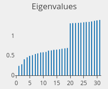

    Figure 9: On the right side of the ViRelAy UI the eigenvalues for the currently selected embedding method are displayed.

Below the eigenvalue plot, a list of all clusters of the current clustering are displayed. These can be used to quickly select all sample points belonging to a cluster, by clicking the corresponding clustering. The quick selection buttons display the corresponding color of each cluster in the embedding viewer, as well as the number of samples in the cluster. An example of a cluster quick selection list can be seen in Figure 10.

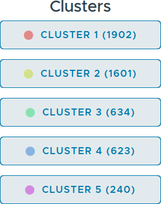

    Figure 10: On the right side of the ViRelAy UI the quick selection buttons for the clusters of the currently selected clustering method are displayed.

Inputs, Attributions & Heatmaps
-------------------------------

When sample points have been selected, the sample viewer at the bottom of the ViRelAy UI shows the samples corresponding to the selected sample points (to increase performance, only the first 20 samples will be displayed). Beneath each sample, the cluster to which the sample belongs is displayed. Furthermore, when hovering over the image with the mouse pointer, the label predicted by the classifier is shown, which can be used to find samples that were misclassified. An example of samples being displayed in the sample viewer can be seen in Figure 11.

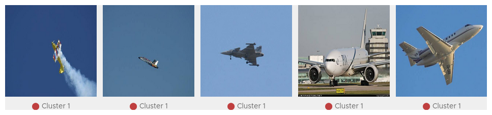

    Figure 11: Selected samples are displayed in the sample viewer at the bottom of the ViRelAy UI.

Depending on the currently selected visualization mode, the sample viewer will display the dataset sample, which is the input of the classifier, the attribution of the classification, or an attribution superimposed onto the dataset sample. Figure 12 shows the display mode selection in the toolbox.

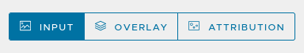

    Figure 12: In the toolbox, the display mode for the samples in the sample viewer can be selected.

The overlay mode superimposes the heatmap onto the input image, thus enabling us to directly see the underlying image features, while the attribution mode only shows the heatmap in input space. When the attributions are fine and detailed it usually makes sense to directly view the heatmaps, as the image details can be seen in the heatmaps. When the attributions are coarse, it is harder to correlate the heatmap to the corresponding image regions, therefore, the overlay mode makes it easier to find the actual image features that were attributed. Figure 13 shows the same sample in all 3 modes.

    Figure 13: A sample image visualized in all 3 display modes.

The heatmaps highlight the pixels that contributed positively or negatively to the classification result. Positive attribution means that the image region contributed positively towards the classification result, whereas negative attribution means that the image region contributed negatively, i.e., it speaks against the class that was the classification result. Attributions are displayed as heatmaps using the currently selected color map. The color map that is used to render the heatmaps for a contribution can be selected in the toolbox at the top of the ViRelAy UI. Figure 14 shows the heatmap selection.

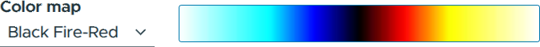

    Figure 14: The color map that is used to render the heatmaps can be selected in the toolbox.

Importing, Exporting & Sharing
------------------------------

When something interesting was found, e.g., heatmaps that indicate Clever Hans behavior of the classifier, then it is important to save these findings for documentation. To this end, ViRelAy supports the export and import of the current state of the application. Clicking on the export button in the toolbar will generate a JSON file containing the currently selected project, analysis, category, embedding, clustering, color map, sample viewer display mode, the samples displayed in the sample viewer, as well as the currently selected samples. This file can then be later loaded by clicking the import button, or used on its own for further custom evaluation or plotting. Loading the JSON file will restore the exact same state that ViRelAy was in when the finding was exported. The export, import, and share buttons in the toolbar can be seen in Figure 15.

.. figure:: ../../images/user-guide/features/import-export-share-buttons.png
    :alt: Import, Export & Share Buttons in the ViRelAy UI
    :align: center

    Figure 15: The toolbar contains 3 buttons for importing, exporting, and sharing findings.

When ViRelAy is run on a remote server for collaboration, users may want to directly share their findings with others. This can be easily achieved by clicking the share button, which will open a dialog with a link that can be copied and shared with others. The link contains the currently selected project, analysis, category, embedding, clustering, color map, sample viewer display mode, and the currently selected samples. Opening the link will restore the exact same state that ViRelAy was in when the sharable link was generated. The share link dialog can be seen in Figure 16.

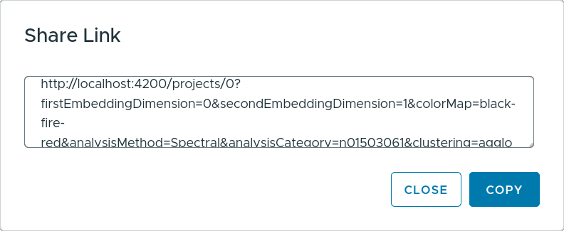

    Figure 16: When clicking the share button in the toolbar a sharable link is generated, which is displayed in a dialog.
