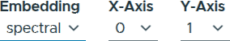
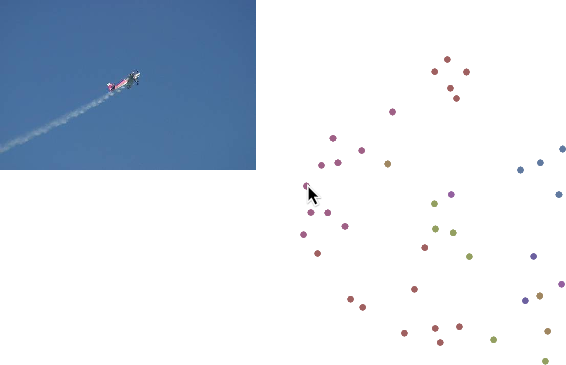
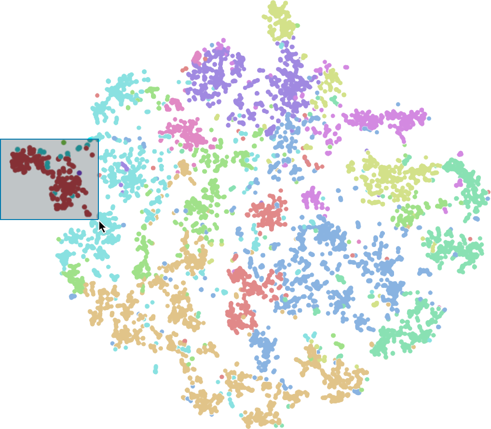
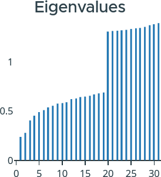
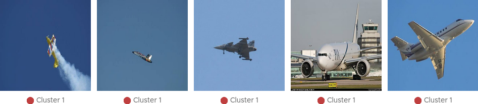

========
Features
========

This section provides an in-depth exploration of ViRelAy's key features and capabilities. For those new to the application, we recommend starting with our :doc:`../getting-started/basic-usage` tutorial, which offers a concise overview of the user interface and its fundamental components.

Projects
========

When starting ViRelAy, at lease one project file must be specified, which contains essential metadata about your project, such as its name, model, dataset, and references to relevant files. The project file format is detailed in the :doc:../contributors-guide/project-file-format article. A sample project file is provided below for reference:

.. code-block:: yaml

    project:
    name: VGG16 ILSVRC2012-small SG
    model: VGG16
    label_map: datasets/ilsvrc2012/label-map-ilsvrc2012.json
    dataset:
        name: ILSVRC2012-small
        type: hdf5
        path: datasets/ilsvrc2012/ilsvrc2012-small.input.h5
        input_width: 224
        input_height: 224
        down_sampling_method: none
        up_sampling_method: none
    attributions:
        attribution_method: smoothgrad
        attribution_strategy: true_label
        sources:
        - ilsvrc2012-small-sg/attribution/ilsvrc2012-small.smoothgrad.h5
    analyses:
        - analysis_method: spectral_analysis
        sources:
            - ilsvrc2012-small-sg/analysis/ilsvrc2012-small.smoothgrad.h5

ViRelAy allows you to load multiple project files simultaneously, which can be beneficial for comparing multiple similar classifiers. You can specify multiple project files as arguments when running ViRelAy using its command-line interface or the built-in HTTP server:

.. code-block:: console

    $ virelay '<project-file>' ['<project-file>' ...]

Alternatively, you can pass multiple project files to the ``run_wsgi_app`` function when running ViRelAy with Gunicorn, either by specifying them as arguments or by setting the ``VIRELAY_PROJECTS`` environment variable. The ``projects`` argument of the ``run_wsgi_app`` function takes precedent over the environment variable.

.. code-block:: console

    $ # Specifying multiple projects using the projects argument of the run_wsgi_app function
    $ gunicorn \
        --workers 4 \
        --bind 127.0.0.1:8000 \
        "virelay.application:run_wsgi_app(projects=['path/to/project-1.yaml', 'path/to/project-2.yaml'])"

    $ # Or using the VIRELAY_PROJECTS environment variable
    $ export VIRELAY_PROJECTS="path/to/project-1.yaml:path/to/project-2.yaml"
    $ gunicorn \
        --workers 4 \
        --bind 127.0.0.1:8000 \
        "virelay.application:run_wsgi_app()"

In the ViRelAy user interface, loaded projects are displayed as tabs at the top of the page, alongside the application logo. Clicking on a project tab navigates you to its respective page.

Clicking a project tab will navigate the user to the respective project's page. The project selection can be seen in Figure 1.

    Figure 1: The project selection in the ViRelAy UI.

The currently selected project's name, dataset, and model are displayed in the footer of the ViRelAy UI within the project info pane (cf. Figure 2).

    Figure 2: The project info pane in the ViRelAy UI, which shows some basic information about the currently selected project.

Analyses
========

An analysis represents the output of a quantitative analysis pipeline created with CoRelAy. These pipelines employ techniques, such as Spectral Relevance Analysis (SpRAy) :cite:p:`lapuschkin2019cleverhans`, to generate visual embeddings and clusterings of attributions. Attributions are derived from dataset samples using the project's classifier, often through tools like Zennit.

Each ViRelAy project can comprise multiple analyses, which can be accessed through the toolbox located at the top of the UI, below the project selection area (cf. Figure 3).

    Figure 3: Selecting an analysis from the toolbox.

Clusterings & Embeddings
========================

As stated above, an analysis comprises visual representations of attribution clusterings and embeddings. Each analysis can incorporate multiple embeddings, generated using various methods, as well as multiple clusterings, employing different techniques and parameters for each embedding. The resulting embeddings are categorized to facilitate efficient organization and exploration. A category usually corresponds to a class of the dataset, but it can also be used to multiple classes in multi-label classification scenarios or other concepts.

In the ViRelAy UI, category selection is performed through the toolbox at the top of the screen. Additionally, the toolbox enables users to select embedding methods and clustering techniques. The embedding viewer, situated at the center of the UI, displays embedding vectors from the current category using the selected embedding method and clustering technique. The embedding vectors are color-coded according to the selected clustering technique. The tools for navigating analyses can be seen in Figure 4.

.. figure:: ../../images/user-guide/features/category-embedding-clustering-selection.png
    :alt: Category Selection, Embedding Selection, and Clustering Selection in the ViRelAy UI
    :align: center

    Figure 4: Selecting categories, embeddings, and clusterings of the analysis in the toolbox.

When working with high-dimensional embeddings (i.e., more than two dimensions), users can customize the axes used for visualization. The toolbox provides a dimension selection interface, allowing users to choose which dimensions are displayed on the X and Y axes of the embedding viewer (cf. Figure 5).

    Figure 5: Selecting dimensions for high-dimensional embeddings.

Navigating Embeddings
=====================

The central component of the ViRelAy user interface is the embedding viewer, located in the center of the window. This interactive visualization displays the embedding vectors for the sample of the currently selected sample category using the chosen embedding method. The points are colored according to their cluster affiliation based on the currently selected clustering algorithm. Figure 6 illustrates an example of an embedding being visualized in the embedding viewer.

    Figure 6: The embedding viewer in the ViRelAy UI, where the embedding vectors for the samples of the currently selected category are visualized using the selected embedding method.

The embedding viewer supports two primary modes of interaction:

**Panning**: Click and hold the right mouse button to initiate panning, then move the mouse pointer to navigate the visualization.

**Zooming**: Scroll the mouse wheel to zoom into or out of the region where the mouse pointer is currently positioned. Alternatively, click and hold the middle mouse button to start zooming, then move the mouse pointer up or down to adjust the zoom level.

When hovering over an embedding vector in the embedding viewer, a preview of the corresponding dataset sample (i.e., the input of the classifier) is displayed at the top left corner of the visualization. This can be seen in Figure 7.

    Figure 7: When hovering the mouse pointer over an embedding vector in the embedding viewer, a preview of the dataset sample is displayed in the upper left corner of the embedding viewer.

To select a subset of embedding vectors, click and hold the left mouse button and draw a selection rectangle over the desired points. To highlight the selected embedding vectors, they are displayed with an increased saturation. This process can be observed in Figure 8.

    Figure 8: Embedding vectors can be selected in the embedding viewer by left-clicking and dragging the mouse pointer.

On the far right side of the user interface, several additional features are available:

**Eigenvalue Plot**: If the currently selected embedding method uses eigenvalue decomposition, this plot displays the eigenvalues in ascending order. Large changes between successive eigenvalues are referred to as *eigengaps*, which can be used to determine the optimal number of clusters. Hovering over the eigenvalues will display the number of clusters the eigenvalue corresponds to. An example of an eigenvalue plot can be seen in Figure 9.

    Figure 9: On the right side of the ViRelAy UI the eigenvalues for the currently selected embedding method are displayed.

**Cluster Quick Selection**: Below the eigenvalue plot, a list of all clusters for the currently selected clustering algorithm is displayed. By clicking on one of these buttons, you can quickly select all embedding vectors belonging to that cluster. Figure 10 illustrates shows the quick selection buttons for the clusters.

.. figure:: ../../images/user-guide/features/cluster-quick-selection.png
    :alt: The Cluster Quick Selection in the ViRelAy UI
    :align: center

    Figure 10: On the right side of the ViRelAy UI the quick selection buttons for the clusters of the currently selected clustering method are displayed.

Inputs, Attributions & Heatmaps
===============================

When embedding vectors are selected in the embedding viewer, the sample viewer at the bottom of the window provides an interactive visualization of the corresponding dataset samples. This viewer is optimized for performance by displaying only the first 20 samples. Below each sample image, the cluster affiliation is displayed.

To facilitate the analysis of misclassified samples, hovering over the image with the mouse pointer reveals the predicted label from the classifier. This information enables users to identify and inspect samples that were incorrectly classified. An example of samples being displayed in the sample viewer can be seen in Figure 11.

    Figure 11: The samples for selected embedding vectors are displayed in the sample viewer at the bottom of the ViRelAy UI.

Depending on the currently selected visualization mode, the sample viewer visualizes the samples in a different way:

**Input Mode**: The dataset sample, i.e., the input image used by the classifier, is displayed.
**Attribution Mode**, A heatmap illustrating the contribution of individual pixels towards the classification result, is displayed.
**Overlay Mode**: A combination of input image and attribution is displayed, which superimposes the heatmap onto the dataset sample image.

The selection of visualization modes is facilitated through a button group in the toolbox (cf. Figure 12).

    Figure 12: In the toolbox, the display mode for the samples in the sample viewer can be selected.

The overlay mode superimposes the heatmap onto the input image, thus enabling us to directly see the underlying image features, while the attribution mode only shows the heatmap in input space. When the attributions are fine and detailed it usually makes sense to directly view the heatmaps, as the image details can be seen in the heatmaps. When the attributions are coarse, it is harder to correlate the heatmap to the corresponding image regions, therefore, the overlay mode makes it easier to find the actual image features that were attributed. Figure 13 shows the same sample in all 3 modes.

    Figure 13: A sample image visualized in all 3 display modes.

Heatmaps provide an intuitive representation of attribution values by highlighting pixels that positively or negatively contributed to the classification result. Positive attributions indicate regions that supported the predicted class, while negative attributions suggest areas that contradicted it.

The heatmaps are rendered using a selected color map, which can be chosen from a variety of options within the toolbox (cf. Figure 14). This allows users to customize their visualization according to their preferences and better interpret attribution values.

.. figure:: ../../images/user-guide/features/color-map-selection.png
    :alt: Color Map Selection in the ViRelAy UI
    :align: center

    Figure 14: The color map that is used to render the heatmaps can be selected in the toolbox.

Exporting, Importing & Sharing Results
=======================================

ViRelAy provides several features for managing and sharing results, allowing users to export their findings for documentation, import saved states for reproducibility, and share their results with others.

Exporting Results
-----------------

To capture your analysis progress or save specific findings for later reference, click the "Export" button in the toolbar (cd. Figure 15). This will generate a JSON file containing the current project configuration, including:

* Current project
* Selected Analysis
* Category, embedding, and clustering settings
* Color map configurations and ample viewer display mode
* Currently displayed samples and selected embedding vectors

.. figure:: ../../images/user-guide/features/import-export-share-buttons.png
    :alt: Import, Export & Share Buttons in the ViRelAy UI
    :align: center

    Figure 15: The toolbar contains 3 buttons for importing, exporting, and sharing findings.

Importing Saved States
----------------------

This JSON file can be imported later using the "Import" button or used independently for further evaluation, plotting, or sharing. To restore a previously exported state, click the Import button in the toolbar. ViRelAy will load the saved configuration, restoring the exact same settings and selected embedding vectors that were present when the export was created (cf. Figure 15).

Sharing Results with Others
---------------------------

For collaborative work or knowledge transfer, users can share their findings by clicking the "Share" button in the toolbar. This will generate a unique link containing the current project configuration, which can be copied and shared with others.

When the recipient opens this sharable link, ViRelAy will restore the exact same state that was present when the link was generated (cf. Figure 16). This ensures seamless collaboration and knowledge transfer between team members or stakeholders.

.. figure:: ../../images/user-guide/features/share-link-dialog.png
    :alt: Share Link Dialog in the ViRelAy UI
    :align: center

    Figure 16: Clicking the "Share" button in the toolbar generates a sharable link, which can be copied from the share link dialog.
