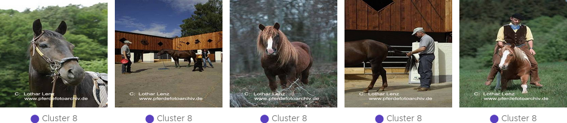

===================================================
Analyzing Machine Learning Classifiers and Datasets
===================================================

This guide provides an in-depth walkthrough on how to utilize ViRelAy to evaluate a machine learning classifier and its underlying dataset. Through a systematic exploration of ViRelAy's features, we will investigate the prediction behavior of the classifier and identify Clever Hans classification strategies that arise from flaws in the training data.

The concept of Clever Hans originates from 19th-century Germany, where a horse was purported to possess basic arithmetic abilities. However, it was later revealed that the horse was exploiting subtle involuntary cues from its trainer's body language to achieve accurate results. Similarly, in machine learning, Clever Hans classification strategies involve leveraging spurious correlations present in the training data, which are unlikely to be available in real-world scenarios. As a result, these classifiers fail to generalize and may prove ineffective when deployed in practical applications.

Project Overview
================

This guide is based on an in-depth analysis of a Fisher vector classifier trained on the `Pascal VOC 2007 <http://host.robots.ox.ac.uk/pascal/VOC/voc2007/>`_ dataset, a benchmark for object recognition tasks. For further details on this specific implementation and its evaluation, please refer to :cite:p:`lapuschkin2019cleverhans`.

Upon opening the project, users will be presented with the familiar interface, as depicted in Figure 1 below.

    Figure 1: The initial screen when opening the ViRelAy project for the Fisher vector classifier trained on Pascal VOC 2007.

Examining the Embeddings
========================

To initiate analysis, it is often beneficial to first explore the data and gain insight into its structure. One effective approach is to examine the various categories (corresponding to the classes in the Pascal VOC 2007 dataset) using different embeddings methods. The choice of embedding method highly depends on the project and some embedding methods may be better suited to identify potential issues with the classifier or dataset than others. In this case, the t-SNE embedding yields a more informative representation, whereas the spectral embedding's sub-dimensions tend to be less revealing.

Examining Clusterings & Classification Strategies
=================================================

Upon further analysis of the embeddings, it is essential to investigate their clustering structure. In this example, spectral embeddings were subjected to *k*-means clustering using various values for *k*. As the embeddings are derived from attributions, distinct clusters can be interpreted as different classification strategies employed by the classifier.

However, the effectiveness of clustering methods may vary depending on the project at hand. In some cases, explicit clusterings generated through techniques like *k*-means, i.e., the color-coded clusters in the embedding viewer, might provide valuable insights into the classifier's decision-making processes. Conversely, in other projects, the visual clustering inherent to the embedding itself (e.g., t-SNE), i.e., the arrangement of the embedding vectors in the embedding viewer, may be more informative.

In this specific case, *k*-means clustering does not appear to yield substantial information, prompting a closer examination of the visual clustering within the t-SNE embedding. To gain deeper insights into the categories, we can search for small clusters that stand out in the t-SNE embedding.

Our analysis reveals that some categories exhibit highly homogeneous embeddings, while others display heterogeneous distributions with notable outliers. A striking contrast is observed between the class bird and horse, as depicted in Figure 2.

    Figure 2: A comparison of the embeddings for the classes bird and the horse, highlighting their distinct characteristics.

The class bird exhibits a homogeneous embedding with no apparent outliers, suggesting that the classifier has learned a robust and coherent classification strategy. In contrast, the horse class features multiple smaller outlier clusters, which may indicate the presence of multiple distinct classification strategies. Specifically, when these outlier clusters are small, it could be an indication of Clever Hans behavior, where the classifier has learned to exploit specific features in a small subset of training samples, thus suggesting that the samples have a common, easily exploitable feature.

Investigating Anomalous Classification Strategies
=================================================

Upon identifying a potential candidate for an anomalous classification strategy, it is essential to conduct further analysis to understand the underlying features that contribute to this behavior. This involves examining the input data to determine which specific characteristics are exploited by the classifier.

To facilitate this investigation, hover your mouse pointer over the samples in the outlier classes to visually inspect the corresponding input images. Figure 3 shows the input image of one of the samples in the tear-shaped outlier cluster of the horse class.

.. figure:: ../../images/user-guide/how-to-analyze-classifiers-and-datasets/input-sample-inspection.png
    :alt: Visual Inspection of an Input Sample of Class Horse
    :align: center

    Figure 3: The visual inspection of the input image of a sample of the class horse.

In some cases, it may not be immediately apparent why a particular image is classified as an anomaly. Therefore, selecting multiple samples from the same cluster and visualizing them together can provide additional insights. This can be achieved by left clicking and dragging the mouse pointer to draw a selection around the samples.

Figure 4 illustrates a subset of samples that were selected from the tear-shaped outlier cluster, which all exhibit similar characteristics that are not immediately evident upon initial inspection. However, upon closer examination, certain features become apparent, such as copyright notices at the bottom of each image (Figure 3).

    Figure 4: The input images of the samples in an outlier cluster of the class horse.

This observation raises the hypothesis that the classifier may be exploiting these specific attributes to make classification decisions. To verify this hypothesis, it is necessary to identify the actual features used by the classifier.

To achieve this, switch to the sample viewer's attribution mode or overlay display mode (cf. Figure 5). The attribution view displays a heatmap in input space highlighting which pixels contributed positively or negatively to the classification result. Positive attribution indicates that an image region contributed positively towards the classification outcome, while negative attribution suggests that it contradicted the predicted class. The heatmap is a visual representation of the numerical attribution, the color map used to render the heatmaps can be selected in the toolbox at the top of the ViRelAy user interface.

.. figure:: ../../images/user-guide/how-to-analyze-classifiers-and-datasets/sample-viewer-display-mode-overlay.png
    :alt: Sample Viewer Display Mode
    :align: center

    Figure 5: The display mode of the sample viewer is set to overlay.

The overlay mode superimposes the heatmap onto the input image, thus enabling us to directly see the underlying image features. When the attributions are fine and detailed the best option is to directly view the heatmaps, as the details of the image are evident from the heatmap itself. In cases where attributions are coarse, the overlay mode is more effective for correlating heatmap regions with corresponding image features. In this example, the attributions are indeed relatively coarse, making the overlay mode a suitable choice (cf. Figure 6).

.. figure:: ../../images/user-guide/how-to-analyze-classifiers-and-datasets/input-images-with-attribution-overlay-of-outlier-cluster.png
    :alt: Input Images of the Outlier Cluster in the Class Horse with Attribution Overlay
    :align: center

    Figure 6: The input images of the samples in the outlier cluster of the class *horse* with the attribution heatmap superimposed onto them (sample viewer display mode overlay).

The resulting visualization provides strong evidence in support of the hypothesis that the classifier relies on copyright notices as a primary feature, as the positive attribution is concentrated on the image regions containing the copyright notices (bright red and yellow regions). Conversely, the classifier exhibits minimal to no positive attribution on the image regions containing the horses, with some instances even displaying negative attribution (blue regions).

Further investigation reveals that multiple outlier clusters exhibit similar patterns of Clever Hans behavior, with each cluster featuring a unique copyright notice. This consistency suggests that the classifier is heavily reliant on these attributes to make classification decisions.

Best Practices for Saving & Sharing Findings
============================================

To facilitate further analysis and sharing of findings, it is recommended to save your current state by clicking the export button in the upper-right corner of the toolbar. This will generate a JSON file containing the entire ViRelAy configuration, which can be imported later using the import button.

Saving your findings also enables easy documentation and sharing with others. The export, import, and share buttons are conveniently located at the top of the ViRelAy user interface (cf. Figure 7).

.. figure:: ../../images/user-guide/how-to-analyze-classifiers-and-datasets/import-export-share-buttons.png
    :alt: Import, Export & Share Buttons in the ViRelAy UI
    :align: center

    Figure 7: The toolbar contains three buttons for importing, exporting, and sharing findings.
