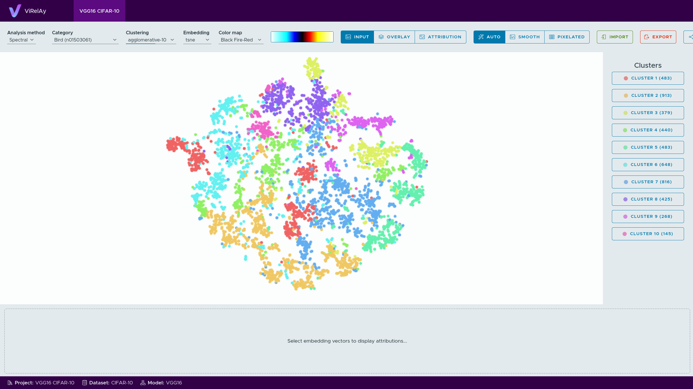

==================================
How to Create a Real-World Project
==================================

If you have familiarized yourself with ViRelAy (e.g., using the test project generated in the :doc:`../getting-started/example-project` article) and you now want to dig deeper and create a ViRelAy project for a custom classifier and dataset, then this guide will lead you step by step through the process. In this guide, a `VGG16 <https://arxiv.org/abs/1409.1556>`_ model will be trained on `CIFAR-10 <https://www.cs.toronto.edu/~kriz/cifar.html>`_ using `PyTorch <https://pytorch.org/>`_, then attributions for all samples in the dataset will be generated using `Zennit <https://zennit.readthedocs.io/en/latest/index.html>`_, and finally, an analysis of the data will be performed using `CoRelAy <https://corelay.readthedocs.io/en/latest/index.html>`_. The resulting data will be written to `HDF5 <https://www.hdfgroup.org/solutions/hdf5/>`_ databases according to the ViRelAy database specification. Please feel free to substitute the VGG16 model and CIFAR-10 with your own model and dataset.

First of all, it is recommended that you create a virtual environment, in order not to clutter your base environment. The following dependencies have to be installed: Zennit, to compute the attributions (with this package, PyTorch will also be installed), CoRelAy, to perform the analysis (optional support for UMAP and HDBSCAN should be installed as well), H5PY, to generate the HDF5 databases required for the ViRelAy project, and PyYAML, to generate the ViRelAy project file. Please refer to the following listing for details.

.. code-block:: console

    $ python -m venv .venv
    $ .venv/bin/pip install zennit corelay[umap,hdbscan] h5py pyyaml

This guide is accompanied by a set of ready-made scripts with an easy-to-use command line interface. If you have installed ViRelAy from the project's Git repository, then you already have the scripts available under :repo:`docs/examples` and :repo:`docs/examples/vgg16-project`. If you installed ViRelAy from PyPI, then you can download the latest version of the VGG16 project scripts from the repository like so:

.. code-block:: console

    $ mkdir vgg16-project
    $ cd vgg16-project
    $ curl -o 'meta_analysis.py' 'https://raw.githubusercontent.com/virelay/virelay/master/docs/examples/meta_analysis.py'
    $ curl -o 'make_project.py' 'https://raw.githubusercontent.com/virelay/virelay/master/docs/examples/make_project.py'
    $ curl -o 'train_vgg.py' 'https://raw.githubusercontent.com/virelay/virelay/master/docs/examples/vgg16-project/train_vgg.py'
    $ curl -o 'explain_vgg.py' 'https://raw.githubusercontent.com/virelay/virelay/master/docs/examples/vgg16-project/explain_vgg.py'
    $ curl -o 'make_dataset.py' 'https://raw.githubusercontent.com/virelay/virelay/master/docs/examples/vgg16-project/make_dataset.py'

The scripts ``meta_analysis.py`` and ``make_project.py``, available under :repo:`docs/examples`, are general-purpose scripts for performing a meta analysis and creating a ViRelAy project file, which can be used for any of your projects. The ``train_vgg.py``, ``explain_vgg.py``, and ``make_dataset.py`` scripts available under :repo:`docs/examples/vgg16-project` are specific scripts, tailor-made for this VGG16 project, but you can use them as a blueprint for your own projects. The ``train_vgg.py`` script trains a VGG16 classifier on the CIFAR-10 dataset using PyTorch, the ``explain_vgg.py`` script uses the trained VGG16 classifier and Zennit to compute attributions for the entire training dataset and stores them in a ViRelAy-compatible attributions database, and the ``make_dataset.py`` script converts the the full CIFAR-10 dataset into a ViRelAy-compatible format.

As stated in the introduction, the ViRelAy project that will be created in this guide is based on a VGG16 model trained on CIFAR-10. The following listing shows how to quickly train the model.

.. code-block:: python

    model = vgg16(num_classes=10).to(device)

    transform = transforms.Compose([
        transforms.ToTensor(),
        transforms.Normalize((0.4914, 0.4822, 0.4465), (0.2023, 0.1994, 0.2010))
    ])
    train_dataset = CIFAR10(
        root='<dataset-path>',
        train=True,
        download=True,
        transform=transform
    )
    train_loader = torch.utils.data.DataLoader(train_dataset, batch_size=64, shuffle=True)

    loss_function = torch.nn.CrossEntropyLoss()
    optimizer = torch.optim.SGD(model.parameters(), lr=0.001, momentum=0.9, weight_decay=5e-4)

    for epoch in range(1, 11):
        for batch, labels in train_loader:
            optimizer.zero_grad()
            prediction = model(batch)
            loss = loss_function(prediction, labels)
            loss.backward()
            optimizer.step()

        number_of_correct_predictions = (prediction.argmax(axis=1) == labels).sum().item()
        accuracy = 100 * (number_of_correct_predictions / batch.size(0))
        print(f'Epoch {epoch}, accuracy = {accuracy:.2f}%')

    torch.save(model.state_dict(), '<model-path>')

Alternatively, the ready-made ``train_vgg.py`` script can be used to train the VGG16 classifier like so:

.. code-block:: console

    $ .venv/bin/python vgg16-project/train_vgg.py \
        '<dataset-path>' \
        '<model-output-path>' \
        --learning-rate 0.001 \
        --batch-size 64 \
        --number-of-epochs 10

In the most basic configuration, the following files are required:

* a *dataset*,
* a *label map*,
* an *attribution database*,
* an *analysis database*, and
* a *project file*.

The *dataset* is either in HDF5 format or an image directory containing the dataset samples in a directory structure, where each sub-directory represents a single class. The dataset contains all images that the classifier was trained on. The *label map* is a JSON file, which contains a mapping between the label index, the name of the class, and optionally the WordNet ID that corresponds to the class. The label map is used to correctly map between label indices or WordNet IDs and human-readable class names in the ViRelAy UI. The *attribution database* is an HDF5 file that contains the attributions for each dataset sample, that were computed using the classifier and a certain attribution method (e.g., using the Zennit framework). Each project can only contain attributions for a single attribution method, but it can contain multiple attribution databases (e.g., an attribution database could be created per class). The *analysis database* is an HDF5 file, which contains the results of an analysis pipeline that was created using CoRelAy. These results are a set of embeddings and clusterings thereof. Each project can contain multiple analyses (e.g., to compare different analysis methods), which each can consists of multiple analysis databases (e.g., an analysis database could be created per embedding or attribution method). The *project file* is a YAML file, which binds all the other files together and contains some meta information about the project. For more information about the database and project file structures, please refer to the articles :doc:`../contributors-guide/database-specification` and :doc:`../contributors-guide/project-file-format`.

Now that we have a trained classifier, the attributions database has to be created. Depending on the shape of the data, the attributions database either consists of 3 HDF5 datasets or of 3 HDF5 groups. HDF5 datasets are very similar to NumPy arrays, so they are suitable for datasets whose images all have the same size. HDF5 groups on the other hand are more like Python dictionaries and are therefore more suitable when the dataset images have varying resolutions. In the case of CIFAR-10, all images are 32x32 pixels and have 3 color channels, thus HDF5 datasets are used. The 3 HDF5 datasets are: ``attribution``, which contains the attributions, ``prediction``, which contains the predictions of the classifier, and ``label``, which contains the ground-truth labels. To make things easier for us, we can create 2 helper functions, one for creating the attributions database and one for appending attributions to it:

.. code-block:: python

    def create_attribution_database(
            attribution_database_file_path,
            attribution_shape,
            number_of_classes,
            number_of_samples):

        attribution_database_file = h5py.File(attribution_database_file_path, 'w')
        attribution_database_file.create_dataset(
            'attribution',
            shape=(number_of_samples,) + tuple(attribution_shape),
            dtype='float32'
        )
        attribution_database_file.create_dataset(
            'prediction',
            shape=(number_of_samples, number_of_classes),
            dtype='float32'
        )
        attribution_database_file.create_dataset(
            'label',
            shape=(number_of_samples,),
            dtype='uint16'
        )
        return attribution_database_file

    def append_attributions(
            attribution_database_file,
            index,
            attributions,
            predictions,
            labels):

        attribution_database_file['attribution'][index:attributions.shape[0] + index] = (
            attributions.detach().numpy())
        attribution_database_file['prediction'][index:predictions.shape[0] + index] = (
            predictions.detach().numpy())
        attribution_database_file['label'][index:labels.shape[0] + index] = (
            labels.detach().numpy())

Now, we can cycle through the entire dataset and compute the attributions using the LRP Epsilon Gamma Box rule, which uses the ZBox rule for the first convolutional layer, the gamma rule for all following convolutional layers, and the epsilon rule for all fully-connected layers. Please note, that by default, the VGG16 implementation of PyTorch Vision, which is used here, does not use BatchNorm, therefore no canonization is required for LRP to work.

.. code-block:: python

    model = vgg16(num_classes=10)
    state_dict = torch.load('<model-path>', map_location='cpu')
    model.load_state_dict(state_dict)

    transform = transforms.Compose([
        transforms.ToTensor(),
        transforms.Normalize((0.4914, 0.4822, 0.4465), (0.2023, 0.1994, 0.2010))
    ])
    train_dataset = CIFAR10(
        root='<dataset-path>',
        train=True,
        download=True,
        transform=transform
    )
    train_loader = torch.utils.data.DataLoader(
        train_dataset,
        batch_size=batch_size,
        shuffle=False
    )
    number_of_samples = len(train_dataset)
    number_of_classes = 10

    with create_attribution_database(
            '<attribution-database-path>',
            train_dataset[0][0].shape,
            number_of_classes,
            number_of_samples) as attribution_database_file:

        composite = EpsilonGammaBox(low=-3.0, high=3.0)
        attributor = Gradient(model=model, composite=composite)

        number_of_samples_processed = 0
        with attributor:
            for batch, labels in train_loader:
                predictions, attributions = attributor(
                    batch,
                    torch.eye(number_of_classes)[labels]
                )
                append_attributions(
                    attribution_database_file,
                    number_of_samples_processed,
                    attributions,
                    predictions,
                    labels
                )
                number_of_samples_processed += attributions.shape[0]
                print(
                    f'Computed {number_of_samples_processed}/{number_of_samples} attributions'
                )

Alternatively, the ready-made ``explain_vgg.py`` script can be used to train the VGG16 classifier like so:

.. code-block:: console

    $ .venv/bin/python vgg16-project/explain_vgg.py \
        '<dataset-path>' \
        '<model-path>' \
        '<attribution-database-output-path>'

For more information on how to use Zennit to compute attributions, please refer to the `official Zennit documentation <https://zennit.readthedocs.io/en/latest/index.html>`_.

The CIFAR-10 dataset distribution consists of multiple Python pickles, which is a format that is not understood by ViRelAy. Therefore, the dataset must be converted into one of the 2 formats supported by ViRelAy: image directories or HDF5 database. Image directories are just what the name implies: the dataset is stored as separate image files in a directory structure. The dataset directory contains directories for all classes and each class directory contains the samples that are in the respective class. Using image directories is only recommended when the dataset is especially large and generating a single file containing the entire database is prohibitive. Like the attribution database, the dataset HDF5 database can also contains its data either as HDF5 datasets or HDF5 groups, depending on whether the images all have the same shape. The dataset HDF5 database contains 2 datasets or groups: ``data``, where the images are stored, and ``label``, which contains the ground-truth labels of the images. Since CIFAR-10 contains fixed-size images, HDF5 datasets are being used here. Similar to generating the attribution database, we create two convenience functions for creating the HDF5 attributions database file and for appending samples to it.

.. code-block:: python

    def create_dataset(dataset_file_path, samples_shape, number_of_samples):

        dataset_file = h5py.File(dataset_file_path, 'w')
        dataset_file.create_dataset(
            'data',
            shape=(number_of_samples,) + tuple(samples_shape),
            dtype='float32'
        )
        dataset_file.create_dataset(
            'label',
            shape=(number_of_samples,),
            dtype='uint16'
        )
        return dataset_file

    def append_sample(dataset_file, index, sample, label):

        dataset_file['data'][index] = sample
        dataset_file['label'][index] = label

Additionally, a label map file is required, which helps ViRelAy map the class indices to human-readable names.

.. code-block:: python

    classes = [
        'Airplane',
        'Automobile',
        'Bird',
        'Cat',
        'Deer',
        'Dog',
        'Frog',
        'Horse',
        'Ship',
        'Truck'
    ]
    wordnet_ids = [
        'n02691156',
        'n02958343',
        'n01503061',
        'n02121620',
        'n02430045',
        'n02084071',
        'n01639765',
        'n02374451',
        'n04194289',
        'n04490091'
    ]
    label_map = [{
        'index': index,
        'word_net_id': wordnet_ids[index],
        'name': classes[index],
    } for index in range(number_of_classes)]
    with open(label_map_file_path, 'w', encoding='utf-8') as label_map_file:
        json.dump(label_map, label_map_file)

A ready-made script, which both converts the dataset and creates a label map file is available and can be used like so:

.. code-block:: console

    $ .venv/bin/python vgg16-project/make_dataset.py \
        '<dataset-path>' \
        '<dataset-output-path>' \
        '<label-map-output-path>'

Now we proceed to the most important part of creating a project: the meta analysis. In this example, we will construct a simple spectral analysis for the attributions using CoRelAy. CoRelAy uses the pipeline pattern to perform analyses. A pipeline is constructed from multiple smaller building blocks, which each perform a part of the analysis. CoRelAy makes it easy to setup the computational pipeline and re-use interim results without having to re-compute them. For an in-depth introduction to CoRelAy and more examples, please refer to the `official CoRelAy documentation <https://corelay.readthedocs.io/en/latest/index.html>`_. The following listing shows a simple spectral analysis pipeline.

.. code-block:: python

    pipeline = SpectralClustering(
        preprocessing=Sequential([
            SumChannel(),
            Normalize(),
            Flatten()
        ]),
        embedding=EigenDecomposition(n_eigval=32, is_output=True),
        clustering=Parallel([
            Parallel([
                KMeans(n_clusters=number_of_clusters) for number_of_clusters in range(2, 31)
            ], broadcast=True),
            TSNEEmbedding()
        ], broadcast=True, is_output=True)
    )

The following code listing shows how the analysis pipeline is executed for all categories, i.e., for all classes of the CIFAR-10 dataset. First, the label map is loaded to get the WordNet IDs of all classes, then the attribution database is loaded to retrieve the labels of all samples in the dataset (this could be done with the dataset HDF5 file as well, but the attribution file is also used in another place, so there is no need to involve more files than necessary). Then, all classes of the CIFAR-10 are cycled through, their indices and attribution data is loaded and the analysis pipeline is executed for them. Finally, the resulting embeddings and clusterings are stored in the analysis file.

.. code-block:: python

    with open('<label-map-file-path>', 'r', encoding='utf-8') as label_map_file:
        label_map = json.load(label_map_file)
        wordnet_id_map = {label['index']: label['word_net_id'] for label in label_map}

    with h5py.File('<attribution-file-path>', 'r') as attributions_file:
        labels = attributions_file['label'][:]

    for class_index in range(10):
        with h5py.File('<attribution-file-path>', 'r') as attributions_file:
            indices_of_samples_in_class, = numpy.nonzero(labels == class_index)
            attribution_data = attributions_file['attribution'][indices_of_samples_in_class, :]

        (eigenvalues, embedding), (kmeans, tsne) = pipeline(attribution_data)

        with h5py.File('<analysis-file-path>', 'w') as analysis_file:

            analysis_name = wordnet_id_map[class_index]

            analysis_group = analysis_file.require_group(analysis_name)
            analysis_group['index'] = indices_of_samples_in_class.astype('uint32')

            embedding_group = analysis_group.require_group('embedding')
            embedding_group['spectral'] = embedding.astype(numpy.float32)
            embedding_group['spectral'].attrs['eigenvalue'] = eigenvalues.astype(numpy.float32)

            embedding_group['tsne'] = tsne.astype(numpy.float32)
            embedding_group['tsne'].attrs['embedding'] = 'spectral'
            embedding_group['tsne'].attrs['index'] = numpy.array([0, 1])

            cluster_group = analysis_group.require_group('cluster')
            for number_of_clusters, clustering in zip(number_of_clusters_list, kmeans):
                clustering_dataset_name = f'kmeans-{number_of_clusters:02d}'
                cluster_group[clustering_dataset_name] = clustering
                cluster_group[clustering_dataset_name].attrs['embedding'] = 'spectral'
                cluster_group[clustering_dataset_name].attrs['k'] = number_of_clusters
                cluster_group[clustering_dataset_name].attrs['index'] = numpy.arange(
                    embedding.shape[1],
                    dtype=numpy.uint32
                )

The analysis database is an HDF5 file, which contains an HDF5 group for each category for which an analysis was performed. Usually, there is one category for each class in the dataset, but the data can be categorized as you wish, e.g., categories can be created for multiple classes or even for concepts. For the present project, the data is being categorized by the classes of the CIFAR-10 dataset. Each of the category HDF5 groups of this analysis database will use the WordNet ID of the class as its name (which, again, is just a convention, but if the category name is a WordNet ID, ViRelAy will automatically display the class label). The category groups have a key ``index``, which contains the indices of the samples that are in the category. Furthermore they have sub-group called ``embedding`` and a sub-group called ``cluster``, which contain the embeddings and clusterings computed in the analysis pipeline respectively. Each key in the ``embedding`` sub-group represents a different embedding method, in this project, the attributions will be embedded using spectral embedding and t-SNE. Each embedding can optionally have multiple attributes: ``eigenvalue``, which contains the eigenvalues of the eigendecomposition of the embedding, ``embedding``, which is the name of the base embedding, if the embedding is based on another embedding, and ``index``, which are the indices of the dimensions of the base embedding that were used. Finally, the ``cluster`` sub-group contains the clusterings that were used to cluster the attributions. Each  key in the ``cluster`` sub-group represents a different clustering method with different parameters. In the case of this project, there is only a *k*-means clustering for k's between 2 and 30, so a key for each of these clusterings is generated. Each clustering can have attributes, e.g., ``embedding``, which is the embedding that the clustering is based on, or the parameters of the clustering algorithm.

A more elaborate analysis pipeline, which has more embedding and clustering methods, can be executed using the ``meta_analysis.py`` script. This script can be invoked like so:

.. code-block:: console

    $ .venv/bin/python vgg16-project/meta_analysis.py \
        '<attribution-path>' \
        '<analysis-output-path>' \
        --label-map-file-path '<label-map-path>'

Now, we have all the necessary files to create a project: the dataset HDF5 file, the label map JSON file, the attribution HDF5 file, and the analysis HDF5 file. The only thing that is missing now is the project YAML file.

.. code-block:: yaml

    project:
        name: VGG16 CIFAR-10
        model: VGG16
        label_map: <label-map-path>
        dataset:
            name: CIFAR-10
            type: hdf5
            path: <dataset-path>
            input_width: 32
            input_height: 32
            up_sampling_method: none
            down_sampling_method: none
        attributions:
            attribution_method: LRP Epsilon Gamma Box
            attribution_strategy: true_label
            sources:
            - <attribution-path>
        analyses:
        - analysis_method: Spectral
          sources:
          - <analysis-path>

The project YAML file consists of a project name, a model name, a reference to the dataset file, a reference to the label map file, a reference to the attribution files, and a reference to the analysis files. The project and model name can be chosen arbitrarily and are only used to display them, when the project is opened in ViRelAy. These make it easier to distinguish between multiple loaded projects. The dataset requires some more information. The dataset name, again, can be chosen arbitrarily and is only used for informational purposes. The type property is used to distinguish between image directory datasets and datasets that are stored in HDF5 files. The path either represents the path to the image directory or to the HDF5 dataset file. All paths in the project file are relative to the project file itself. The input width and height properties determine the width and height to which the images have to be re-sampled before feeding them into the classifier. In the case of our VGG16 model this is 32x32 pixels. When the images do not all have the same width and height or when the classifier expects a different input size, then the up-sampling and down-sampling methods determine how the images are scaled up when they are too small or how they are scaled down when they are too large, respectively. The label map represents the path to the label map JSON file. The attributions property consist of an attribution method, which is the algorithm that was used to compute the attributions, the attribution strategy, which determines whether the attribution was computed for the true label or the label assigned by the classifier, and a list of source files. This means that the attributions can be split among multiple HDF5 databases, e.g., an attribution file could be created per class. Finally, the analyses property is a list of analyses that were performed on the data. Multiple analyses can be created to compare different analysis methods. Each analysis consists of the name of the analysis method and a list of source files. So each project can have multiple analyses and each analysis can consist of multiple analysis databases. For example, an analysis database could be created per embedding or attribution method.

This file can also be generated by executing the ``make_project.py`` script, which can be invoked like so:

.. code-block:: console

    $ .venv/bin/python vgg16-project/make_project.py \
        '<dataset-path>' \
        '<attribution-path>' \
        '<analysis-path>' \
        '<label-map-path>' \
        --project-name "VGG16 CIFAR-10" \
        --dataset-name "CIFAR-10" \
        --model-name "VGG16" \
        --attribution-name "LRP Epsilon Gamma Box" \
        --analysis-name "Spectral" \
        --output-file-path '<project-output-path>'

When opening the project, created in this guide, in ViRelAy, you will be greeted with a setup like in Figure 1.

    Figure 1: The VGG16 CIFAR-10 project opened in ViRelAy.
